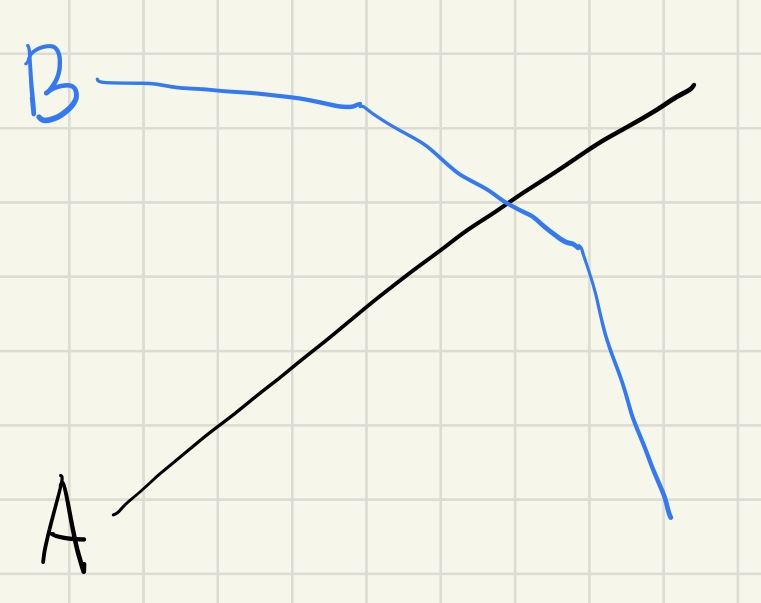

[12743번: 혼합물 (Large)](https://www.acmicpc.net/problem/12743)

# 풀이

* A,B 두 개만 있으므로 A가 0이고, B를 최대화 한 상태에서 A를 증가시킨다고 생각하자. 그러면 B는 감소하게 되는데, 이는 B가 다 차지하고 있는 어떤 물질이 A에 의해 빼앗기기 때문이고(GA가 1이상이므로), 서로 선형적으로 증가/감소하게 된다.
* 속도 < A의 증가속도라면, 해당 물질은 차후 A와 B에 의해 전부 소모되고, 그때부터 B의 감소속도가 A의 증가속도로 바뀌면서 더 빨라지게 된다.
    * 
* 따라서 위와 같은 그래프가 되고, 둘의 합은 위로 볼록한 모양이 되므로 삼분탐색을 쓰면 된다.
