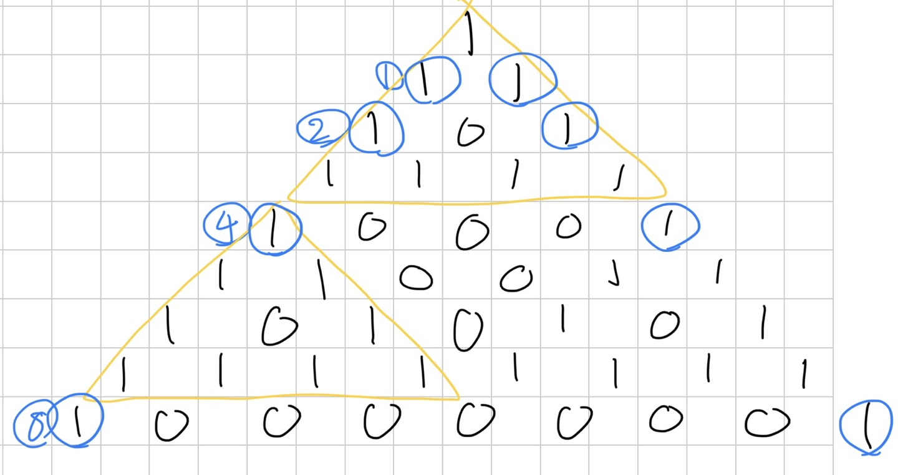

[14046번: Circle of Life](https://www.acmicpc.net/problem/14046)

# 풀이

* 인접한 두 개 중 한 개만 1일 때 1이라는 것을 보면, XOR을 쓸 수 있을 것 같다. 그러면 매 턴마다 현재 배열을 왼쪽으로 한칸/오른쪽으로 한칸 이동시킨 것을 XOR한 것으로 생각할 수 있다.
    * 
* 배열을 1이라고 놓고, 아래로 쭉 나열해보면 파스칼 삼각형에 (mod 2)를 한 모양새가 나온다. 여기서 자세히 살펴보면, 2^x번째에서는 맨 왼쪽/오른쪽에만 1이 있고, 해당 1을 기준으로 sub삼각형이 만들어지는 것을 볼 수 있다. 이것을 이용해 T에서 각 bit마다 좌/우로 배열 전체를 XOR해주면 된다.
