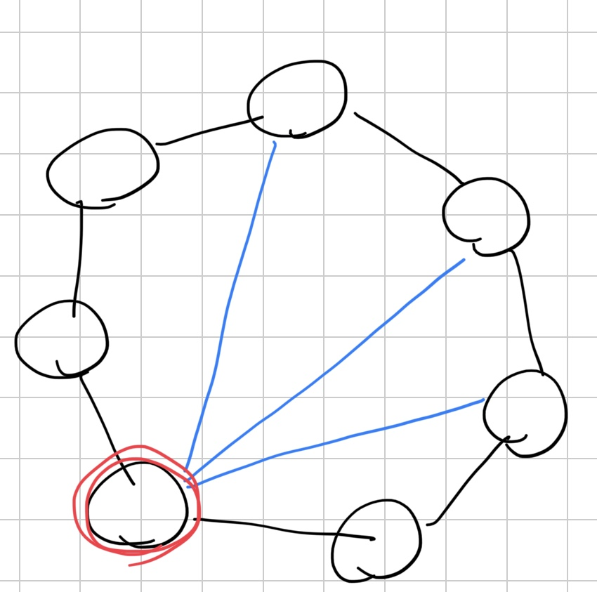

[14866번: 산만한 고양이](https://www.acmicpc.net/problem/14866)

# 풀이

* 정점을 제거했을 때 모든 사이클들을 제거하고 싶다. 그냥 DFS로 사이클을 찾아서 하기에는 사이클이 사이클을 타고 또 사이클을 만드는 경우들이 생겨서 좀 복잡해진다. 여기서 Subtask3을 보면 전체를 도는 사이클이 존재하는 경우이다. 이것을 보고 BCC로 접근할 수 있을 것 같다.
* 한 BCC안에는 무조건 모든 정점을 도는 사이클이 존재한다. 그래야 한 정점을 지워도 다른 정점들이 연결되기 때문이다. BCC들을 묶으면 트리 구조로 형성되기 때문에, 각 BCC별로 사이클을 지우기만 하면 된다.
    * 
* 모든 정점을 도는 사이클을 바깥으로 두면, 원 안에 남은 간선들이 있을 것이다. 여기서 사이클을 제거하려면 남은 간선들을 전부 제거하는 정점을 골라야 한다. 이는 정점의 개수(vNum)과 간선의 개수(eNum)이 있을 때, degree가 eNum-vNum+2보다 크거나 같아야 한다.
* BCC는 한 정점이 여러 BCC에 속할 수 있으므로, 해당하는 정점들이 몇 개의 BCC에 속하는지 세고, 이 개수가 BCC 개수와 같은 정점들이 답이다. 여기서 BCC의 크기가 1(간선 1개)인 것은 제외한다.
