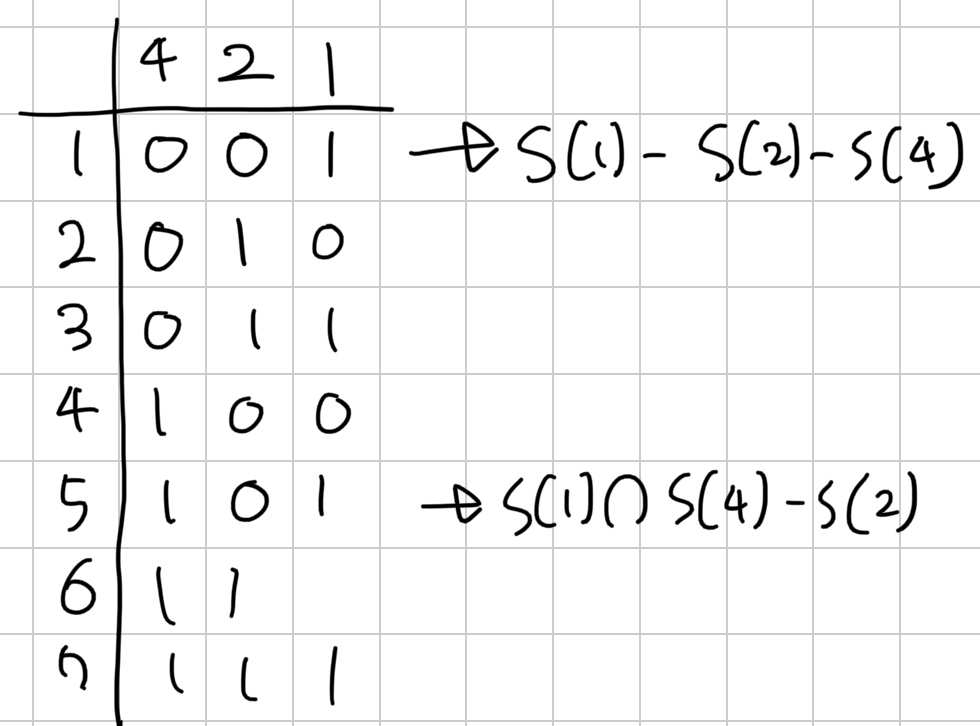

[17957번: Find the Array](https://www.acmicpc.net/problem/17957)

# 풀이

일단 2번 쿼리를 $[1,n]$에 대해서 하면, 결과값의 최댓값은 max-min값이다. 이 값을 이용해 [1~x]로 x를 이분탐색하면 max 혹은 min인 위치를 알 수 있다. 이 위치를 기준점으로 삼자.

특정 위치들을 2번 쿼리에 넣은 결과를 A라 하고, (특정 위치 + 기준점)의 결과를 A'라 할 때, A'-A를 하면 각 위치의 값과 기준점 값의 차이를 구할 수 있다. 이 차이들을 S라 하자.

이제 그림처럼 각 bit가 1인 위치들의 S들을 구하자. 그러면 각 위치의 차이(d)는 1 bit 집합은 교집합, 0 bit 집합은 차집합 해서 구할 수 있다.

기준값이 max라 가정하면 $max-d[i]$로 모든 위치의 값을 구할 수 있다. 만약 기준값이 min이라면 필연적으로 값에 0이하 음수가 나오므로 이것으로 판별하고, $min-d[i]$를 $d[i]-min$으로 바꾸기 위해 $min \cdot 2-d[i]$를 해준다.
