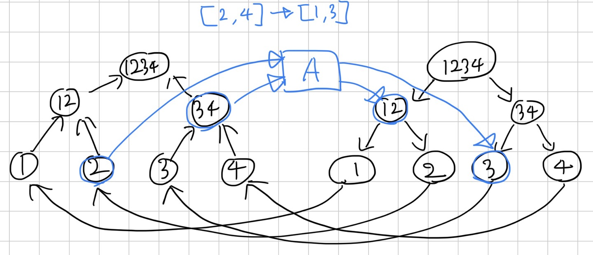

[18193번: 비행기 타고 가요](https://www.acmicpc.net/problem/18193)

# 풀이

* UCPC 2022 I번을 풀 때 쓰는 테크닉을 배우기 위해 푼 문제. 간선이 구간으로 연결되어 있다. 당연히 그냥 연결하면 TLE다. 연속된 정점으로 연결되어 있으므로, 정점을 세그먼트 트리로 표현해보자.
    * 
* 왼쪽은 정점에서 나가는 영역이고, 오른쪽은 들어가는 영역이다.왼쪽은 나가므로 간선의 방향을 위로 하고, 오른쪽은 반대로 들어가므로 방향을 아래로 한다. 만약 [2,3]->[1,3]인 간선이 있다면, 왼쪽/오른쪽에 해당하는 노드들을 연결해주면 되는데, 중간 노드를 만들고 연결해주면 된다.
* 이러면 마치 플로우 그래프 설계와 비슷하게 만들어진다. 모든 간선이 0을 포함한 양수이므로 최단거리는 다익스트라를 이용해 구할 수 있다.
