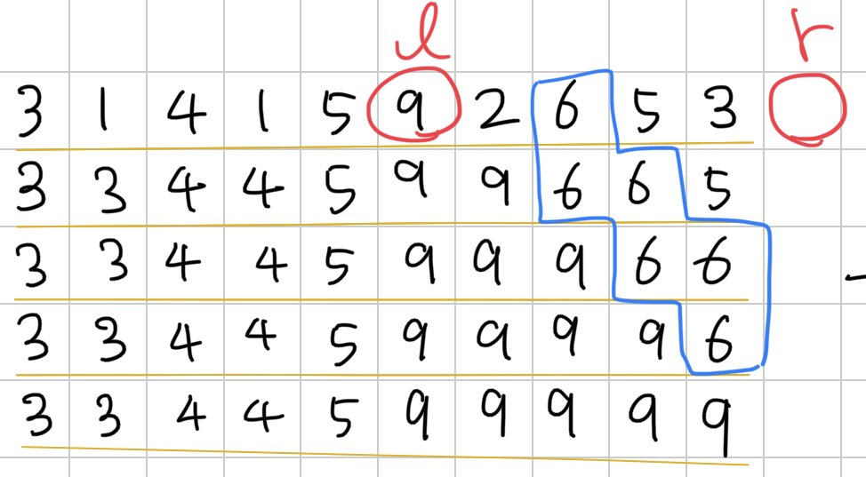
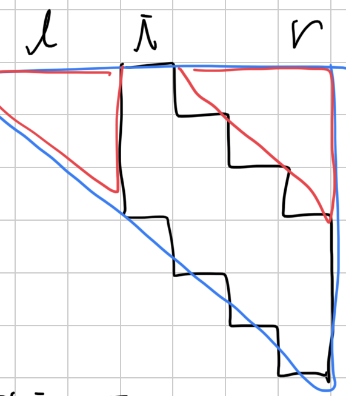
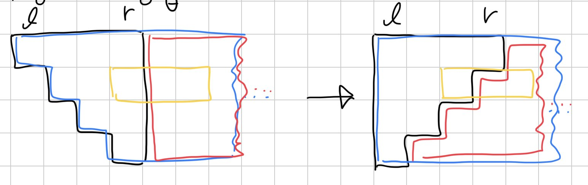

[18435번: Fire](https://www.acmicpc.net/problem/18435)

# 풀이

시간순으로 나열해 보면 각 불들은 평행사변형꼴임을 알 수 있다. 크기는 왼쪽/오른쪽으로 $s[i]$보다 큰 불의 위치에 따라 결정된다. (주의할 점은 같은 값이 연속으로 있으면 중복될 수 있으므로 $s[l[i]] > s[i], s[i] <= s[r[i]]$ 이렇게 한 쪽은 크고, 다른 쪽은 크거나 같은 것을 찾아야 함)

평행사변형꼴은 삼각형 3개로 바꿀 수 있고, 삼각형은 range update 2+2번으로 표현할 수 있다.

삼각형이 검정색으로 있으면 파란색 - 빨간색으로 생각할 수 있다. 빨간색은 그냥 range update로 처리하고, 파란색은 각 줄마다 왼쪽으로 밀었다고 생각하면 역시 range update로 처리 가능하다.

이제 각 시간대 별로 range update들을 구했으니 쿼리를 시간순으로 순회하면서 구하면 된다.
