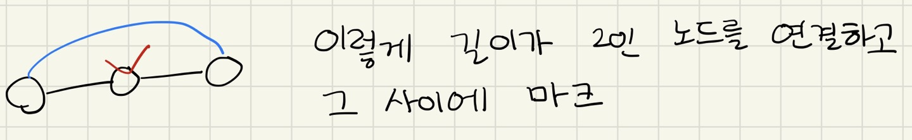
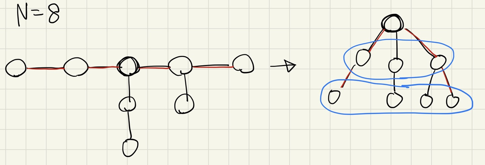

[22029번: 철도](https://www.acmicpc.net/problem/22029)

# 풀이

* Subtask문제들을 주어진 특수한 조건들을 해결하면 쉽게 풀리는 경우가 많다. 하나씩 생각해보자. Sub2는 가짜간선이 1개다. 표시한 정점에 간선을 추가하기에는, 어떤 간선을 지워야할지 몰라서 풀기가 어렵다.
    * 
* 대신에 위 그림처럼 표시한 정점에서 점점 퍼져나가는 방식으로 간선을 추가하면 어느 간선을 지워야 할지 알 수 있다. 이것으로 Sub3까지 해결 할 수 있다.
    * 
* Sub4는 트리의 지름이 최대 ⌊N/2⌋라는 뜻이다. 지름을 기준으로 생각해보면, 지름은 Sub3처럼 일자인 형태이고, 지름 중간에 남은 정점들이 연결되어 있는 형태이다. 지름의 중심을 루트로 하는 트리를 생각해보자. 그러면 같은 깊이를 가진 정점들끼리는 서로 직접 연결되어 있지 않다.
* 따라서 같은 깊이의 정점들을 가짜 간선들로 연결하면, 나중에 쉽게 지울 수 있다. 지름에서 남은 정점을 추가할 때마다 (현재 깊이의 정점 개수-1)만큼 가짜 간선을 추가할 수 있으므로, 모든 K에 대해서 만족한다.
* Sub5는 가장 최악의 경우가 일자인 형태라고 생각하는데, 이는 Sub3로 가능하다. 다만 어느 정점을 루트로 해야할 지 모르므로, 그냥 다 시도해보면 된다.