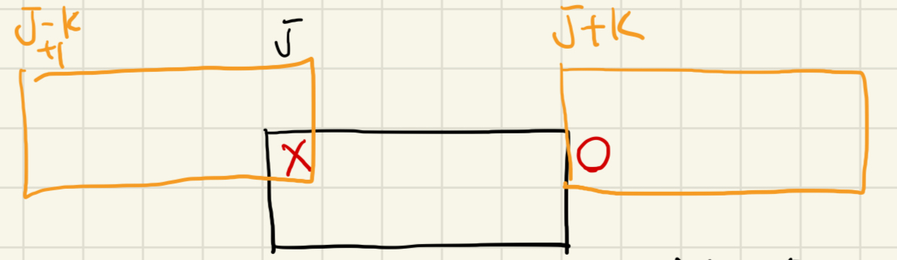

[24837번: Animal Observation (hard version)](https://www.acmicpc.net/problem/24837)

# 풀이

* 우리가 구하고자 하는 값은 2 x K의 영역이므로, 해당 영역의 왼쪽 위를 기준으로 값들을 미리 계산하고 생각해보자.
* 만약 i번째 날에 카메라를 둔다면, i-1번째에 둔 카메라의 위치에만 영향을 받는다. 이를 dp식으로 세워보면 `dp[i][j] = i번째날에 j위치에 카메라를 둘 때 최대값 = max(dp[i-1][k] + d[i][k] - 겹치는 영역), k=[0, m-k-1]` 이 된다.
* 이때, k를 모두 돌려보기에는 50 * 10000 * 10000 = 50억으로 시간 안에 나올 수가 없다.
    * 
* dp식을 채우는 과정을 생각해보자. 그러면 j가 하나씩 늘어날 때마다 겹치는 구간은 왼쪽/오른쪽 하나만 변하게 된다. 이때 이전 dp값들 중에 영향을 받는 구간은 위 그림처럼 [j-k+1, j], [j+1, j+k]이고, 이는 연속된 구간이다.
* 이는 lazy segment tree를 이용하거나, deque를 활용한 dp로 해결할 수 있다.
