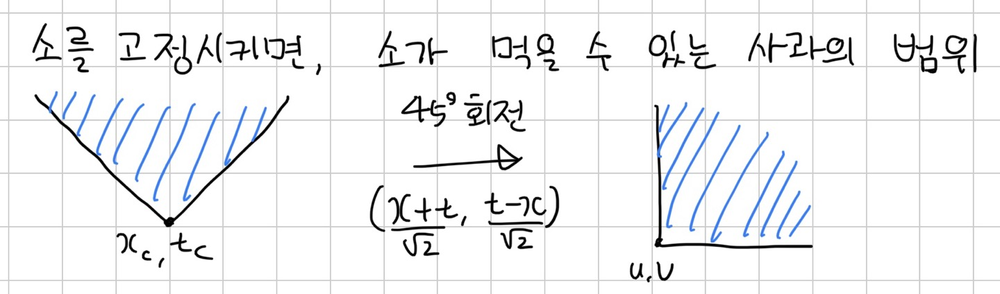

[24974번: Apple Catching](https://www.acmicpc.net/problem/24974)

# 풀이

사과를 $a$, 소를 $c$라고 했을 때 소가 사과를 먹을 수 있는 경우는 $|x_a-x_c| \leq |t_a-t_c|$, $t_a \geq t_c$인 경우다. 여기서 x축/t축의 좌표계로 생각하자.

소를 고정시키면 V 위쪽이 소가 먹을 수 있는 사과의 범위다. 이것을 $(u,v)=(x+t, t-x)$를 하면 시계방향으로 45도 돌아가, 범위는 사각형으로 바뀐다.

사과를 기준으로 그리디하게 생각해보자. 사과를 $v_a$를 기준으로 작은것부터 보자. 그러면 매칭되는 소는 일단 $v_c \leq v_a$여야 한다. 이제 $u$에 대해서 봐야하는데, $u_a$보다 작으면서 가장 가까이 있는 $u_c$가 최적이다.

만약 가장 가까이 있는 소를 다른 사과가 사용한다고 가정해보자. 그러면 현재 사과는 $u_a$보다 더 작은 소를 사용하게 되는데, 이 소는 다른 사과도 접근이 가능하기 때문에 서로 바꿔도 된다. 이것을 multimap으로 관리하면 된다.
