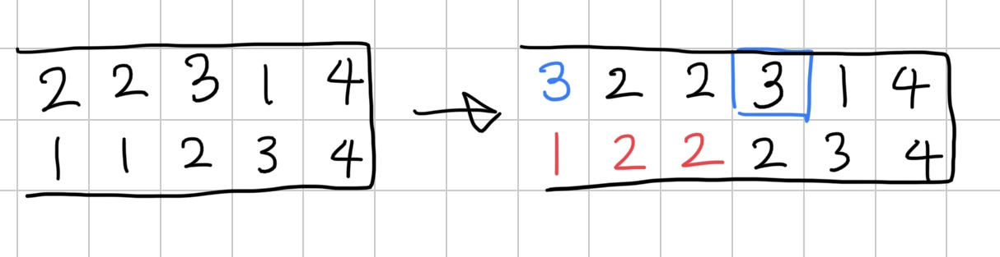

[25389번: 대충 카드로 몬스터 잡는 게임](https://www.acmicpc.net/problem/25389)

# 풀이

* [1,K]의 카드를 다 쓰는 것을 구간으로 생각해보자. 그러면 구간의 최소 크기는 ceil(k/2)가 된다(매 턴 2장씩 쓰는 경우). 구간 내에서 몬스터 처치 횟수는 중복되지 않는 몬스터의 개수이다. 이제 DP식을 세울 수 있다.
* 편의상 뒤에서부터 생각하면, dp[i] = [i,N]까지 있을 때 최댓값 = max([i,j-1] 구간의 distinct 개수 + dp[j]) (j = [i+ceil(k/2), n]) 가 된다.
* dp[j]는 segment tree로 구할 수 있으나, distinct개수가 문제다. i에서 시작해서 distinct 개수를 담은 배열이 있을 때, 앞에 새로운 수가 나오면 아래 그림처럼 변하고, 바뀌는 값은 다음에 나오는 새로운 수 이전까지 +1이 된다. 이것을 lazy segment tree로 더해주면 된다.
* 
* 주의할 점은 dp[j]가 j-1로 끝나는 구간이랑 더해지기 때문에, 새로운 수 이전 위치가 r이라 하면 [i+1, r+1] 범위를 +1해야 한다.
