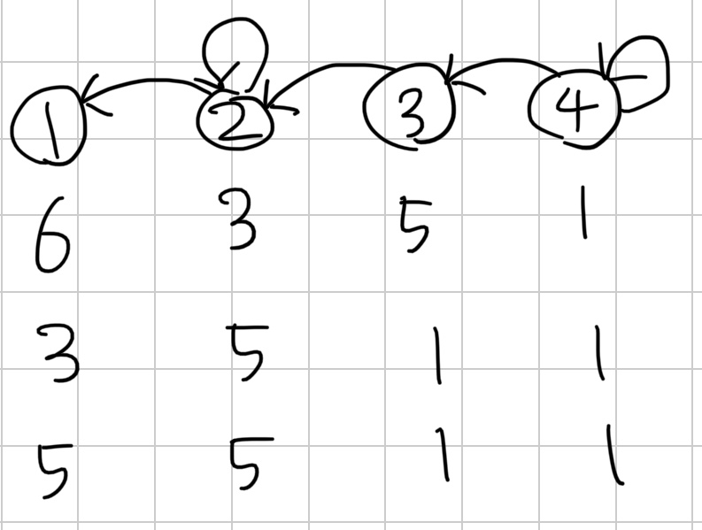
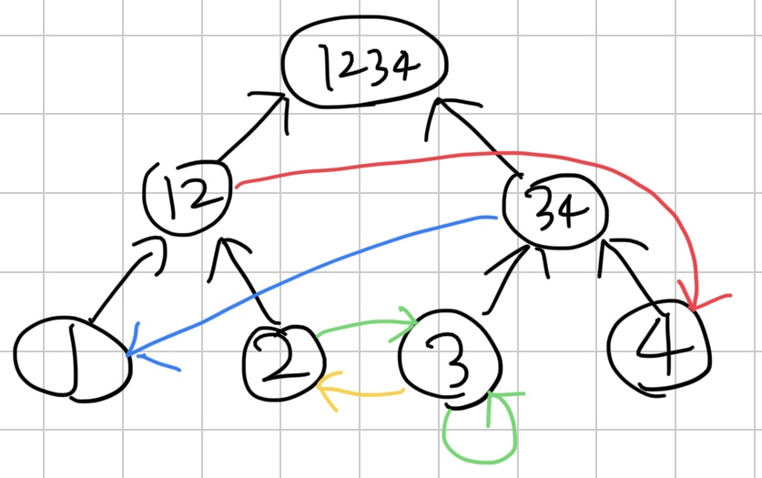

[25392번: 사건의 지평선](https://www.acmicpc.net/problem/25392)

# 풀이

* 다른 수열이 바뀌는 것을 [l,r]->v인 간선으로 생각하자. 가장 큰 수에서 생각해보면, 가장 큰 수가 그래프를 타고 퍼져나가게 된다. 이것을 SCC로 생각해보면, SCC 내부에서는 내부에서 가장 큰 수로 다 바뀌게 된다. 여기에 SCC들을 묶어서 생각하면 DAG 이므로, DP로 최댓값을 갱신해주면 된다.
    * 
* 여기서 예외가 하나 있는데, SCC에 사이클이 없으면 자신의 값은 결국 SCC밖으로 나가게된다. SCC에 사이클이 없을 조건은 1.크기가 1 / 2.self-loop 간선이 없음 이다. 이런 SCC들은 무조건 이전 SCC들의 값들로 덮히기 때문에 DP 이후 따로 처리해줘야 한다.
    * 
* 여기서 문제는 간선의 개수가 N^2으로 너무 많다는 점이다. 그런데 구간으로 추가되는 간선은, 정점을 세그먼트 트리로 관리해 풀 수 있다 (비행기 타고 가요([BOJ18193](https://www.acmicpc.net/problem/18193)) 참고). 나가는 쪽에만 구간이 있으므로, 위 그림처럼 올라가는 세그먼트 트리를 구성하자.
* [구간에 해당하는 노드들]->[도착 노드]로 전부 연결해주면 된다. 이 그래프를 가지고 위와 똑같이 하면 된다.