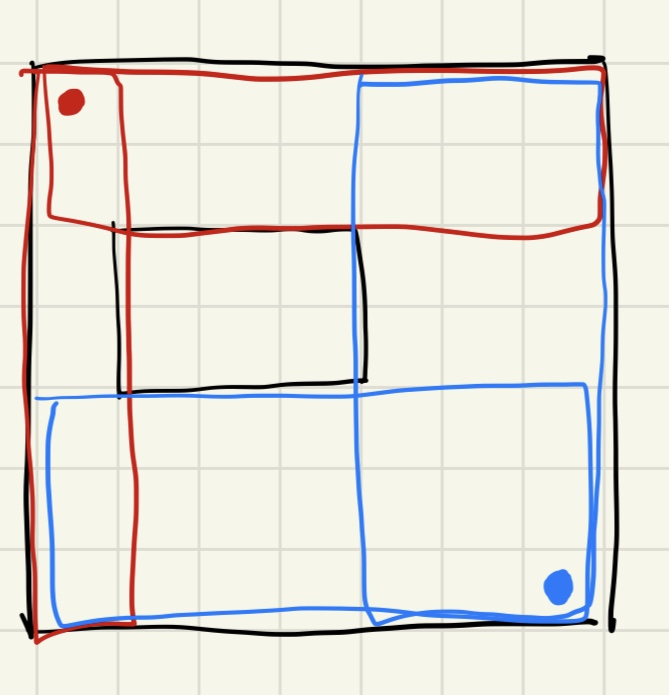

[25589번: 푸앙이와 코인](https://www.acmicpc.net/problem/25589)

# 풀이

* 
* 단 그물 1개만 이용하는 것은 2차원 누적합을 이용해 O(N^3)에 해결이 된다. 그물 2개를 이용하기 때문에, 그물 1개를 고정시켜보자. 그러면 남는 공간은 상하좌우가 남는다. 이것을 (0,0)과 (n-1,n-1)모서리를 기준으로 생각해보면 각각 2개의 사각형이 나오고, 이 영역들의 최댓값을 구하면 된다.
* 영역의 최댓값은 모서리를 기준으로 dp[i][j]=max(dp[i-1][j], dp[i][j-1], max(p(i-k,j-k,i,j)) (0<=k<=min(i,j)) 로 구해주면 된다. (n-1,n-1)은 방향만 바꿔서 반대로 구해주면 된다.