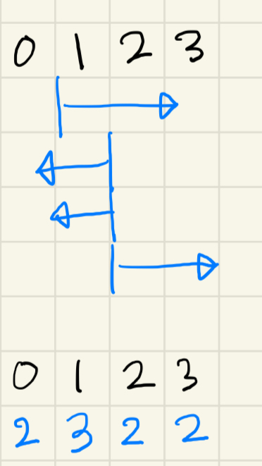

[31091번: 거짓말](https://www.acmicpc.net/problem/31091)
출처: [Good Bye, BOJ 2023!](https://www.acmicpc.net/category/detail/4089) B번

# 풀이

* 거짓말을 하고 있는 사람을 기준으로 생각해보자.
* 
* i명 이상 거짓말을 하고 있다고 주장하는 사람은, 거짓말을 하는 사람의 수가 늘어나도 참이다.
* 반대로 i명 이하 거짓말을 하고 있다고 주장하는 사람은, 거짓말을 하는 사람의 수가 줄어들어도 참이다.
* 이것을 prefix sum 2개를 써서, i명이 거짓말을 하고 있을 때 참인 사람의 수를 구할 수 있다.
* 따라서 i명이 거짓말을 하고 있으면 N - d[i]가 거짓말인 사람의 수가 되고, 둘이 맞는 경우만 출력해주면 된다.
